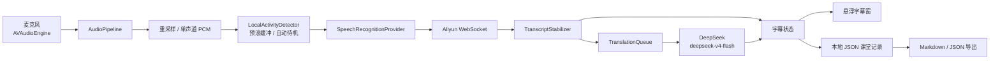

# LectureCaption macOS MVP 开发文档

> 文档状态：Draft 1.4
> 最后更新：2026-08-11
> 目标平台：macOS 14+ / Apple Silicon
> 开发语言：Swift 6
> 预计工期：单人 2～3 周
> 发布范围：个人使用，不面向 App Store

## 1. 项目概述

LectureCaption 是一款面向课堂、网课和教学视频的 macOS 实时字幕工具。第一版应用从麦克风采集音频，将音频直接发送到云端实时语音识别服务，持续显示原文，并对已经确认的短句生成中文粗译。

第一版的目标是优先建立一条低延迟、可长时间稳定运行的实时转写链路。翻译、保存和界面展示都不能阻塞原文转写。

### 1.1 产品目标

- 支持麦克风输入。
- 实时显示临时原文与已确认原文。
- 对已确认短句异步生成中文粗译。
- 提供始终置顶、可拖动的悬浮字幕窗口。
- 支持课程名称、本节主题和专业术语表。
- 本地检测输入活动，持续静音时自动暂停云端识别并在声音恢复时自动继续。
- 在本机保存课堂原文和译文。
- 支持导出 Markdown 和 JSON。
- API Key 仅保存在本机应用配置目录中。

### 1.2 非目标

第一版不实现以下能力：

- 用户登录、账号体系和云同步。
- 多人说话人识别。
- 会议摘要、知识库问答和课后智能分析。
- 本地离线语音或翻译模型。
- App Store 发布及沙盒上架适配。
- MiMo 分块 ASR；该能力将在 MVP 验收完成后作为独立版本重新评估。
- Intel Mac 性能优化。
- 系统音频采集；在后续独立 feature 中重新评估。
- 默认保存原始音频。

## 2. 核心原则

1. **原文优先**：音频采集和 STT 事件处理是最高优先级链路，翻译失败或变慢不得影响转写。
2. **保持原始事实**：原文只能来自 STT 服务事件，不使用 LLM 改写或补全。
3. **只翻译确认文本**：临时结果仅用于显示，不进入翻译队列和持久化最终记录。
4. **有序写回**：翻译请求可以异步执行，但必须按字幕段 ID 精确写回，不能依赖响应顺序。
5. **故障可恢复**：网络中断时保留已有字幕和会话，明确显示连接状态，并允许自动或手动重连。
6. **隐私最小化**：默认不落盘音频，不记录密钥、完整请求头或敏感 API 响应。
7. **薄供应商抽象**：当前 MVP 只实现阿里云流式识别；后续供应商接入不得让网络协议渗透到音频层和 UI。
8. **本地先行节流**：输入活动判断在本机完成，静音期间不持续占用云端识别任务；重新检测到输入后自动恢复。

## 3. 技术选型

| 模块 | 技术 | 说明 |
|---|---|---|
| 开发语言 | Swift 6 | 启用严格并发检查 |
| 主界面 | SwiftUI | 设置、课程配置和历史记录 |
| 悬浮字幕窗 | AppKit `NSPanel` + SwiftUI | 支持置顶、无焦点干扰和多显示器 |
| 麦克风采集 | `AVAudioEngine` | 使用输入节点 tap 获取音频帧 |
| 音频转换 | `AVAudioConverter` | 转换为服务端要求的 PCM 格式 |
| 云端 ASR | 阿里云百炼 | MVP 使用实时流式识别 |
| 本地输入检测 | Accelerate `vDSP` + 自适应能量门 | 只判断是否有有效输入，不做本地转写 |
| 文本翻译 | DeepSeek `deepseek-v4-flash` | 仅翻译已确认短句，关闭 thinking |
| 网络层 | `URLSessionWebSocketTask`、`URLSession` | 分别处理 STT 实时流和 DeepSeek HTTPS 请求 |
| 并发模型 | Swift Concurrency、Actor | 隔离音频、字幕和翻译状态 |
| 本地存储 | 本地 JSON | 保存课程会话和字幕段，便于个人使用与恢复 |
| API Key 存储 | 本机明文 JSON | 位于 Application Support，文件不提交 Git、不写入日志 |
| 日志 | `OSLog` | 使用分类日志并隐藏敏感字段 |
| 导出 | Markdown、JSON | 输出完整双语课堂记录 |

### 3.1 DeepSeek 翻译接入决策

MVP 使用 DeepSeek V4 Flash 作为文本翻译模型：

- Base URL：`https://api.deepseek.com`。
- Endpoint：`POST /chat/completions`。
- API 模型 ID：`deepseek-v4-flash`。
- 当前模型版本：`DeepSeek-V4-Flash-0731`；客户端只使用稳定模型 ID，不绑定日期版本名。
- 鉴权 Header：`Authorization: Bearer <DEEPSEEK_API_KEY>`。
- 请求格式：OpenAI Chat Completions 兼容格式。
- 推理模式：显式设置 `thinking.type=disabled`，避免默认思考模式增加字幕延迟。
- 响应模式：MVP 使用非流式响应，便于处理超时、取消和严格的字幕段写回。
- 客户端实现：Swift `URLSession`，不引入 OpenAI SDK。
- 密钥存储：本机 `LocalCredentials.json`，不提交 Git。

DeepSeek 只处理已经确认的文本短句，不接收音频、不参与原文修订，也不作为 STT 故障的降级转写服务。翻译服务不可用时继续显示和保存阿里云原文。

每次翻译请求重放最近 6 条已确认的原文，并在已有时带上它们的已完成译文，形成有界的连续对话上下文。模型可据此优化当前句的语序、指代和省略，但不得改写原文、补充事实或修改先前字幕；单次请求失败不会污染后续上下文。

参考文档：

- [DeepSeek API 快速开始](https://api-docs.deepseek.com/)
- [DeepSeek 模型与定价](https://api-docs.deepseek.com/quick_start/pricing)

### 3.2 阿里云百炼实时 STT 接入决策

MVP 使用阿里云百炼实时语音识别 WebSocket API 作为原文转写服务：

- 默认模型：`qwen-audio-3.0-asr-flash-streaming`。
- 新加坡地域地址：`wss://{WorkspaceId}.ap-southeast-1.maas.aliyuncs.com/api-ws/v1/inference`。
- 北京地域地址：`wss://{WorkspaceId}.cn-beijing.maas.aliyuncs.com/api-ws/v1/inference`。
- 鉴权：WebSocket 握手请求头 `Authorization: Bearer <DASHSCOPE_API_KEY>`。
- Workspace：URL 中使用真实 Workspace ID；可同时发送 `X-DashScope-WorkSpace` 请求头。
- 音频：二进制 PCM、16 kHz、单声道。
- 连接模式：`duplex`，客户端发送音频的同时接收增量结果。
- 断句：MVP 默认使用低延迟 VAD 断句，`semantic_punctuation_enabled=false`。
- 静音阈值：先使用默认 `max_sentence_silence=1300` ms，通过真实课堂测试后再调整。
- 心跳：设置 `heartbeat=true`，覆盖小于自动待机阈值的短暂停顿；达到自动待机阈值后仍主动结束任务。
- 专业词：将会话术语表映射为 `vocabulary` 即时热词，权重默认 3；不要默认使用权重 50。
- 语言：将用户选择映射为 `language_hints`；未选择时由模型自动识别，最多发送 4 个语言代码。

选择 `qwen-audio-3.0-asr-flash-streaming` 的原因是其支持即时热词、上下文更新和最多 4 个语言提示，适合课程术语与中英文混说。供应商模型名保留为配置项，便于后续切换到 Fun-ASR-Realtime 系列，但 MVP 不同时维护多模型行为分支。

官方协议要求的交互顺序为：

```text
WebSocket 握手
  -> run-task
  <- task-started
  -> 二进制单声道音频块
  <- result-generated（持续多次）
  -> finish-task
  <- 剩余 result-generated
  <- task-finished
  -> 关闭或复用连接
```

参考文档：

- [WebSocket API](https://help.aliyun.com/zh/model-studio/fun-asr-realtime-websocket-api)
- [客户端事件](https://help.aliyun.com/zh/model-studio/fun-asr-client-events)
- [服务端事件](https://help.aliyun.com/zh/model-studio/fun-asr-server-events)

### 3.3 MiMo ASR（MVP 后评估）

Xiaomi MiMo ASR 不纳入当前 MVP。完成 `1.0.0` 稳定性与完整验收后，再以独立 feature 评估以下方案：

- Base URL：`https://api.xiaomimimo.com/v1`。
- Endpoint：`POST /chat/completions`。
- 模型：`mimo-v2.5-asr`。
- 输入：完整 WAV 或 MP3 的 Base64/Data URL，编码后最大 10 MB。
- 语言：`asr_options.language` 支持 `auto`、`zh`、`en`。
- 鉴权：使用 MiMo API Key，按 OpenAI 兼容请求通过 Bearer Token 发送。
- 客户端实现：Swift `URLSession`，本地将 PCM 分块封装为内存 WAV 后提交。
- 密钥存储：本机 `LocalCredentials.json`，不提交 Git。

MiMo 接口不支持客户端持续上传 PCM。官方示例中的 `stream=true` 只控制文本响应的返回方式，不会把文件级 ASR 变成实时流式输入。因此它采用以下分块策略：

- 检测到有效输入后开始累积音频。
- 遇到至少 600 ms 静音或累计达到 4 秒时提交一个 WAV 块。
- 相邻强制切块保留约 400 ms 重叠，并按规范化文本与时间窗口去重。
- 只把完成的分块结果映射为 final，不伪造 partial。
- 分块只存在内存；请求结束后立即释放，默认不写入磁盘。
- 会话结束、手动暂停或自动待机前，先 flush 尚有有效输入的尾块。

该方案用于供应商对照、复杂噪声或方言场景。未来界面必须明确显示“MiMo 分块识别”，不能标记为“实时流式”。

参考文档：

- [MiMo-V2.5-ASR 语音识别](https://mimo.mi.com/docs/zh-CN/quick-start/usage-guide/audio/Speech-Recognition)

## 4. 系统架构



### 4.1 数据流

1. 用户使用麦克风作为输入源。
2. 捕获层输出原始音频缓冲区。
3. `AudioPipeline` 将其转换为单声道 PCM，同时送入本地活动检测器和预滚缓冲区。
4. 检测到有效输入时，激活所选 ASR Provider，并先发送预滚音频再发送实时音频。
5. 阿里云 Provider 持续发送 PCM 并接收增量结果。
6. 持续静音达到阈值时先 flush/结束远端任务，再进入本地待机；本地采集和活动检测继续运行。
7. `TranscriptStabilizer` 只更新当前临时字幕；收到 final 后提交不可变字幕段。
8. 已提交字幕立即保存，同时进入 `TranslationQueue`。
9. `LLMTranslationProvider` 通过 DeepSeek Chat Completions API 翻译当前短句。
10. 翻译完成后，按字幕段 ID 更新内存状态和本地记录。
11. 字幕窗口通过可观察状态实时刷新，结束课程后可导出完整记录。

### 4.2 建议目录结构

```text
LectureCaption/
├── App/
│   ├── LectureCaptionApp.swift
│   └── AppState.swift
├── Audio/
│   ├── AudioCaptureService.swift
│   ├── MicrophoneCapture.swift
│   ├── AudioConverter.swift
│   ├── LocalActivityDetector.swift
│   └── PreRollAudioBuffer.swift
├── Speech/
│   ├── SpeechRecognitionProvider.swift
│   ├── AliyunRealtimeSTTProvider.swift
│   ├── AliyunSTTMessage.swift
│   ├── TranscriptEvent.swift
│   └── TranscriptStabilizer.swift
├── Translation/
│   ├── TranslationProvider.swift
│   ├── LLMTranslationProvider.swift
│   └── TranslationQueue.swift
├── Session/
│   ├── LectureSession.swift
│   ├── CaptionSegment.swift
│   └── SessionStore.swift
├── Features/
│   ├── CaptionWindow/
│   ├── CourseSetup/
│   ├── SessionHistory/
│   └── Settings/
├── Security/
│   └── KeychainStore.swift
└── Export/
    ├── MarkdownExporter.swift
    └── JSONExporter.swift
```

## 5. 领域模型与状态

### 5.1 字幕段

```swift
struct CaptionSegment: Identifiable, Codable, Sendable {
    let id: UUID
    let sequence: Int
    var sourceText: String
    var translatedText: String?
    var startedAt: TimeInterval
    var endedAt: TimeInterval?
    var state: CaptionState
}

enum CaptionState: String, Codable, Sendable {
    case provisional
    case committed
    case translating
    case completed
    case translationFailed
}
```

`sequence` 用于稳定排序和导出；`id` 用于翻译结果精确写回。服务端若提供稳定的事件 ID，应额外保存，用于去重和断线恢复。

### 5.2 课堂会话

```swift
struct LectureContext: Codable, Sendable {
    var courseName: String
    var topic: String
    var sourceLanguage: String
    var targetLanguage: String
    var glossary: [GlossaryEntry]
}

struct GlossaryEntry: Identifiable, Codable, Sendable {
    let id: UUID
    var source: String
    var target: String
}
```

持久化的 `LectureSession` 至少包含：会话 ID、开始与结束时间、课程上下文、连接异常摘要和有序字幕段列表。

### 5.3 应用状态机

```text
idle
  -> requestingPermission
  -> monitoringLocal
  -> activatingProvider
  -> recognizing
  -> stopping
  -> completed

recognizing -> autoPaused -> activatingProvider
recognizing -> manuallyPaused
autoPaused -> manuallyPaused
manuallyPaused -> monitoringLocal（用户点击继续）
任意活动状态 -> recoverableError -> activatingProvider
任意活动状态 -> fatalError -> stopping
```

`autoPaused` 仍保留本地采集和活动检测，检测到输入后自动进入 `activatingProvider`；`manuallyPaused` 不自动恢复远端识别，必须由用户明确继续。状态转换必须集中管理，避免 UI、采集层和网络层分别维护互相冲突的布尔值。

## 6. 模块设计

### 6.1 音频采集

统一接口负责启动、暂停、停止和输出麦克风音频缓冲区。

内部音频格式优先采用：

- Linear PCM 16-bit。
- 单声道。
- 16 kHz，或使用 STT API 明确要求的采样率。
- 每个网络音频块覆盖 20～100 ms。
- 音频块包含单调递增序号，便于诊断丢包和乱序。

麦克风使用 `AVAudioEngine` 输入节点 tap。系统音频采集不属于当前 MVP，后续需要作为独立 feature 重新设计并验证权限与稳定性。

### 6.2 本地输入活动检测与自动待机

`LocalActivityDetector` 在音频发送到云端前运行，只用于判断当前是否存在值得识别的输入，不进行语音转写或保存音频。MVP 使用 Accelerate `vDSP` 计算短窗 RMS/peak，并基于 dBFS、自适应噪声底和滞回阈值判断活动状态。

默认参数：

| 参数 | 默认值 | 说明 |
|---|---:|---|
| 分析窗口 | 20 ms | 与网络音频块解耦 |
| 启动确认 | 200 ms | 连续超过启动阈值后判定输入恢复 |
| 释放保持 | 600 ms | 短停顿不立即结束一句或分块 |
| 自动待机阈值 | 30 s | 可选 15/30/60 秒或关闭 |
| 预滚缓冲 | 800 ms | 云端恢复后优先发送，避免漏掉首音节 |
| 启动阈值 | 噪声底 + 12 dB | 同时设置最低绝对 dBFS 下限 |
| 停止阈值 | 噪声底 + 6 dB | 与启动阈值形成滞回，避免频繁抖动 |

处理规则：

1. 本地采集启动后始终维护固定容量预滚环形缓冲区。
2. 未检测到输入时不创建云端任务。
3. 输入连续满足启动确认后，创建远端任务并先注入 800 ms 预滚音频。
4. 短静音只用于断句/分块；累计静音达到自动待机阈值后结束远端任务。
5. 自动待机期间继续以本地方式检测输入，不产生 ASR API 费用。
6. 声音恢复后创建新的供应商任务或请求序列，保持同一个课堂会话。
7. 用户手动暂停优先级高于自动恢复；手动暂停后即使检测到声音也不发送云端请求。

能量门只能判断“存在明显声音”，无法可靠区分讲话、音乐和环境噪声。麦克风噪声环境若误触发率过高，再将检测器实现替换为 WebRTC VAD，外部接口和状态机保持不变。

### 6.3 音频转换

`AudioConverter` 负责：

- 将设备原始采样率重采样到目标采样率。
- 将多声道下混为单声道。
- 转换为目标 PCM 位深和字节序。
- 聚合或拆分为固定时长的数据块。
- 复用转换器和缓冲区，避免每帧分配内存。

采集回调中不得执行网络请求、JSON 编码或 UI 更新。音频块应立即交给独立 Actor 或有界缓冲区处理；缓冲区达到上限时记录指标并采用明确的丢弃策略。

### 6.4 语音识别 Provider

```swift
protocol SpeechRecognitionProvider: Sendable {
    var capabilities: SpeechProviderCapabilities { get }
    func start(configuration: SpeechConfiguration) async throws
    func send(audio: Data) async throws
    func flush() async throws
    func events() -> AsyncThrowingStream<TranscriptEvent, Error>
    func stop() async
}
```

`SpeechProviderCapabilities` 显式声明 `supportsPartialResults`、`acceptsStreamingPCM`、`supportsVocabulary` 和 `supportedLanguages`，供 UI 和会话协调器决定可用设置。`SpeechConfiguration` 包含公共音频/语言设置及供应商配置枚举；阿里云配置持有 Workspace、热词和断句参数。API Key 不进入配置值类型，由 Provider 从本机 `LocalCredentials.json` 读取，且不得出现在错误描述中。

`AliyunRealtimeSTTProvider` 负责：

- 使用带 `Authorization` 请求头的 `URLRequest` 建立 `URLSessionWebSocketTask`。
- 生成 UUID 格式 `task_id`，发送 `run-task` JSON 文本帧。
- 收到 `task-started` 前禁止发送二进制音频。
- 任务启动后发送 PCM 二进制帧，并并行接收服务端事件。
- 解析 `result-generated`、`task-finished` 和 `task-failed`。
- 将供应商字段映射为统一 `TranscriptEvent`。
- 处理限流、鉴权失败、服务端断开和网络切换。
- 正常停止时先发送 `finish-task`，继续读取结果直到 `task-finished`，再关闭或复用连接。
- 确保 `stop()` 可重复调用，且同一个任务只发送一次 `finish-task`。

`run-task` 的 MVP 请求骨架如下：

```json
{
  "header": {
    "action": "run-task",
    "task_id": "<UUID>",
    "streaming": "duplex"
  },
  "payload": {
    "task_group": "audio",
    "task": "asr",
    "function": "recognition",
    "model": "qwen-audio-3.0-asr-flash-streaming",
    "parameters": {
      "format": "pcm",
      "sample_rate": 16000,
      "semantic_punctuation_enabled": false,
      "max_sentence_silence": 1300,
      "heartbeat": true,
      "language_hints": ["en"],
      "vocabulary": {
        "gradient descent": 3,
        "learning rate": 3
      }
    },
    "input": {}
  }
}
```

服务端事件到内部事件的映射：

| 阿里云事件 | 判断条件 | 内部事件 |
|---|---|---|
| `task-started` | `task_id` 匹配 | `.ready` |
| `result-generated` | `heartbeat=true` | 忽略，仅更新连接活跃时间 |
| `result-generated` | `sentence_end=false` | `.partial` |
| `result-generated` | `sentence_end=true` | `.final` |
| `task-finished` | `task_id` 匹配 | `.finished` |
| `task-failed` | 任意 | `.failed(code, message)`，连接不可复用 |

`result-generated` 中的 `sentence_id` 作为供应商句子 ID，`begin_time` 和 `end_time` 从毫秒转换为秒。`words` 保留在供应商 DTO 或诊断层，MVP 字幕模型不强制持久化字级时间戳。只有 `sentence_end=true` 时 `usage.duration` 才有值，可用于会话用量估算。

重连采用有限指数退避，例如 0.5、1、2、4 秒并设置最大次数。HTTP 401/403 和 `task-failed` 的配置类错误不自动重试；用户停止会话后禁止后台重连。阿里云任务不能跨 WebSocket 恢复，重连必须生成新的 `task_id`，旧任务最后一个未确认 partial 丢弃，已提交字幕保留在同一课堂会话中。

`MiMoChunkedSTTProvider` 负责：

- 接收同一套 16 kHz 单声道 PCM，但只在内存中累积短块。
- 在本地静音边界或 4 秒上限处调用 `WAVEncoder` 封装 PCM。
- 将 WAV 编码为 Base64 Data URL，通过 Chat Completions 提交给 `mimo-v2.5-asr`。
- 把 `asr_options.language` 限制为 `auto`、`zh` 或 `en`。
- 将每个完整响应映射为 final，并携带本地分块 ID 与时间范围。
- 对强制切块的 400 ms 重叠文本执行边界去重。
- `flush()` 只提交含有效输入的尾块；全静音块直接丢弃。
- `stop()` 取消未开始的请求，等待或按会话策略取消在途请求，并释放 Base64/WAV 内存。

MiMo 请求失败只影响对应分块，不得丢弃之前已确认字幕。由于它没有服务端句子时间戳，字幕时间以本地分块起止时间为准，并标记 `timingSource=localChunk`。

### 6.5 字幕稳定器

`TranscriptStabilizer` 是 STT 事件到稳定字幕状态的唯一入口：

- partial 只创建或替换最后一个 `provisional` 字幕段。
- final 将对应临时段转换为 `committed`，之后不再修改原文。
- 重复 final 通过服务端事件 ID 或规范化文本与时间窗口去重。
- 空白事件、仅标点事件和明显重复事件不创建新段。
- final 提交后立即创建下一段，不等待翻译结果。

示例：

```text
partial: The gradient des...
partial: The gradient descent algorithm...
final:   The gradient descent algorithm converges slowly.
```

UI 仅替换最后一条临时字幕，已确认内容不跳动。

### 6.6 翻译队列

翻译只接受 `committed` 字幕段，并立刻将状态更新为 `translating`。默认最大并发数为 1，可在验证供应商限流和有序写回后提高到 2。

每次请求包含：

- 当前已确认短句。
- 最近 3～5 句已确认原文。
- 课程名称和本节主题。
- 用户术语表。
- 原文语言和目标语言。

提示词约束：只返回当前句译文，不解释、不总结、不改写原文；优先采用术语表，必要时保留英文专业词。

```text
课程：Machine Learning
主题：Optimization
术语：gradient descent=梯度下降；learning rate=学习率

上下文：
...

待翻译：
The learning rate controls the size of each optimization step.
```

翻译响应必须携带本地字幕段 ID。成功时更新为 `completed`；超时、限流或解析失败时更新为 `translationFailed`，但继续处理后续字幕。约 3 秒仍未返回时 UI 继续显示原文，不展示阻塞态。

`LLMTranslationProvider` 的最小接口如下：

```swift
protocol TranslationProvider: Sendable {
    func translate(_ request: TranslationRequest) async throws -> String
}
```

DeepSeek 请求使用非流式 Chat Completions，并显式关闭 thinking。单句译文较短，非流式响应更容易处理超时、取消和 JSON 解析；除非实测证明流式响应能显著降低字幕可见延迟，否则 MVP 不启用文本流式输出。

请求示例：

```json
{
  "model": "deepseek-v4-flash",
  "messages": [
    {
      "role": "system",
      "content": "你是课堂字幕翻译器。只输出待翻译句子的简体中文译文。遵守术语表，不解释，不总结。"
    },
    {
      "role": "user",
      "content": "课程：Machine Learning\n主题：Optimization\n术语：gradient descent=梯度下降\n上下文：...\n待翻译：The learning rate controls each optimization step."
    }
  ],
  "thinking": {
    "type": "disabled"
  },
  "max_tokens": 256,
  "stream": false
}
```

客户端必须检查 HTTP 状态码、响应 `choices`、空内容和用量字段。`401/403` 归类为鉴权错误，`429` 遵循服务端退避提示，`5xx` 可有限重试；取消会话时应立即取消尚未开始的翻译任务。

### 6.7 DeepSeek 翻译边界

DeepSeek V4 Flash 在 MVP 中只承担文本翻译：

| 输入 | 允许发送 | 禁止发送 |
|---|---|---|
| 当前字幕 | 已确认的单个原文短句 | partial、空白内容、原始音频 |
| 上下文 | 最近 3～5 条已确认原文 | 整堂课程记录、无界历史 |
| 课程信息 | 课程名、主题、必要术语 | API Key、本地文件路径 |

默认 thinking 模式必须在每次请求中显式关闭。Provider 只接受纯文本 `TranslationRequest`，不得暴露上传文件或音频的入口。响应只读取最终文本内容；若返回空内容、非预期结构或只有推理内容，按翻译失败处理，不得用模型输出覆盖原文。

### 6.8 本地存储

本机 JSON 保存课堂会话和已确认字幕。采用增量保存：

- 首条 final 原文到达后创建本地记录快照。
- 每条 final 原文到达后立即保存。
- 翻译返回后更新对应字幕段。
- 会话结束时写入结束时间和最终状态；工具栏“保存记录”可随时更新当前会话快照。

临时字幕不持久化。写入失败不得停止实时转写，但必须显示非阻塞警告并记录可诊断错误。

### 6.9 本地凭据与日志

- 阿里云百炼与 DeepSeek API Key 只存放在本机 `~/Library/Application Support/LectureCaption/LocalCredentials.json`，不写入日志、导出或 Git。
- 阿里云 Workspace ID 不是密钥，可存入 `UserDefaults`；但不得把它误用为 API Key 或写入鉴权 Header。
- UI 中默认遮蔽密钥，仅提供替换和删除操作。
- 禁止将密钥写入 `UserDefaults`、plist、本地课堂记录、导出文件和日志。
- `OSLog` 只记录连接阶段、错误类别、延迟、队列深度和资源使用指标。
- 请求头、完整提示词、完整 API 响应和原始音频不得写日志。

### 6.10 导出

Markdown 导出建议格式：

```markdown
# Machine Learning - Optimization

- 开始时间：2026-08-11 10:00
- 结束时间：2026-08-11 11:30
- 输入来源：Microphone
- 原文语言：English
- 目标语言：简体中文

## Transcript

### 00:01:24

The gradient descent algorithm converges slowly.

梯度下降算法收敛较慢。
```

JSON 导出应包含完整会话元数据、术语表、字幕 ID、顺序、时间戳、状态和中英文本，便于后续迁移或分析。

## 7. 权限与系统行为

### 7.1 所需权限

- 麦克风权限：线下课堂输入。

首次授权后，系统可能要求重新启动应用。权限界面需分别显示 `未请求`、`已授权`、`已拒绝` 和 `需要重启` 状态，并提供打开系统设置的入口。

### 7.2 音频设备变化

需要监听默认输入设备、耳机和扬声器变化。设备切换时：

1. 暂停发送音频。
2. 重建采集和转换链路。
3. 保持 STT 连接或按供应商要求重连。
4. 在 UI 中展示短暂的恢复状态。
5. 失败时保留会话并允许用户重新开始采集。

## 8. 界面设计

### 8.1 主窗口

主窗口包含：

- 麦克风输入状态。
- ASR Provider：阿里云实时流式识别。
- 课程名称、本节主题和术语表编辑。
- 原文语言和目标语言选择。
- 自动待机设置：关闭、15 秒、30 秒或 60 秒。
- 开始、暂停、继续和结束操作。
- API 与麦克风权限状态。
- 实时音量、输入活动、云端识别和自动待机状态。
- 历史课堂和导出入口。

开始会话前必须完成麦克风权限和所选 Provider API Key 校验。自动待机时显示“本地监听中”，声音恢复后自动继续；手动暂停不会自动恢复。结束操作关闭本地采集和远端任务并完成会话持久化。

### 8.2 悬浮字幕窗口

- 使用非激活型 `NSPanel`，始终置顶但不抢键盘焦点。
- 支持拖动、调整宽度、多显示器和全屏应用。
- 半透明背景，原文在上、译文在下。
- 临时原文使用较浅颜色，与已确认原文明确区分。
- 默认保留最近 3～6 条字幕。
- 支持字号、透明度和显示模式设置。
- 显示模式包括原文、译文和双语。
- 操作工具栏仅在鼠标移入时出现。

字幕窗口只负责展示，不持有业务状态和网络连接。

## 9. 错误处理与恢复

| 场景 | 处理策略 | 用户可见状态 |
|---|---|---|
| 麦克风权限被拒绝 | 禁止启动麦克风采集，提供系统设置入口 | 权限错误 |
| STT 鉴权失败 | 不重试，要求更新 API Key | API 配置错误 |
| STT 网络中断 | 有限指数退避重连，保留会话 | 正在重连 |
| STT 限流 | 遵循服务端重试时间，暂停发送或重连 | 服务繁忙 |
| 本地持续静音 | flush 并结束远端任务，本地检测继续 | 本地监听中 |
| 本地重新检测到输入 | 创建新任务并发送预滚音频 | 正在恢复识别 |
| 翻译超时 | 标记当前段失败，继续后续任务 | 原文正常、译文缺失 |
| 本地保存失败 | 保留内存内容并提示尽快导出 | 保存警告 |
| 音频设备切换 | 重建采集链路 | 正在恢复音频 |
| Mac 睡眠与唤醒 | 暂停采集，唤醒后重新检查权限和连接 | 会话已恢复或等待重连 |

错误分为可恢复错误和致命错误。可恢复错误不能清空当前字幕；致命错误也必须先保存已确认内容，再停止会话。

## 10. 开发计划

### 阶段 1：音频原型（2～3 天）

- 创建 SwiftUI macOS 工程并启用 Swift 6 严格并发。
- 完成麦克风采集。
- 转换为目标 PCM 格式并按固定时长切块。
- 完成本地活动检测、30 秒自动待机和 800 ms 预滚恢复。
- 显示实时音量。
- 验证连续采集 60 分钟。

验收：麦克风能稳定取得音频；静音 30 秒后进入本地待机；重新讲话可自动恢复且不明显漏首音节；内存无持续增长。

### 阶段 2：实时原文（3～4 天）

- 接入阿里云百炼实时语音识别 WebSocket API。
- 完成 `run-task`、音频二进制帧、`finish-task` 生命周期。
- 解析 partial 和 final 事件。
- 实现字幕稳定器和事件去重。
- 支持新 `task_id` 断网重连和主动停止会话。

验收：阿里云模式首段字幕约 1 秒内出现且已确认文字不反复变化；自动待机后已有字幕不丢失。

MiMo `mimo-v2.5-asr` 短 WAV 分块 Provider 推迟至 MVP 完成后，以独立 feature 重新评估和实现，不与阿里云实时 WebSocket 生命周期混入同一个 PR。

### 阶段 3：翻译与专业上下文（2～3 天）

- 接入 DeepSeek `deepseek-v4-flash` Chat Completions API。
- 显式关闭 thinking，并使用非流式响应。
- 实现有界翻译队列和超时控制。
- 加入课程主题、最近上下文和术语表。
- 处理响应乱序、限流与失败重试。

验收：译文通常在原文确认后 1～2 秒出现；翻译失败不影响原文；译文写回正确字幕段。

### 阶段 4：主界面与本地记录（2～3 天）

- 完整字幕记录可滚动回看并支持复制。
- 工具栏调整字幕字号。
- 将课程和识别配置改为工具栏二级窗口。
- 增加本地课堂记录保存、列表和详情查看。

验收：不论字幕条数多少均可查看完整记录；配置不固定占用主工作区；结束或手动保存后重启应用仍能查看完整双语记录。

### 阶段 5：悬浮字幕 UI（2～3 天）

- 实现置顶、非激活型 `NSPanel`。
- 完成临时原文、确认原文和译文布局。
- 实现字号、透明度和显示模式。
- 测试多显示器和全屏应用。

验收：字幕不抢焦点，不影响播放器操作，窗口位置和尺寸在重启后可恢复。

### 阶段 6：导出（1～2 天）

- 完成 Markdown 与 JSON 导出。

验收：导出顺序、时间戳和双语内容正确。

### 阶段 7：稳定性测试（2～3 天）

- 连续运行 2 小时。
- 测试耳机和扬声器切换。
- 测试网络中断、恢复、限流和超时。
- 测试 Mac 睡眠与唤醒。
- 覆盖快速讲话、中英文混说和长时间静音。

验收：满足第 12 节全部 MVP 指标，且不存在阻断课堂使用的问题。

## 11. 测试策略

### 11.1 单元测试

- PCM 格式转换、声道下混和固定时长切块。
- RMS/dBFS 计算、自适应噪声底、滞回、自动待机计时和预滚环形缓冲。
- partial 替换、final 提交、重复 final 去重。
- 翻译队列并发上限、超时和按 ID 写回。
- 会话状态机的合法和非法转换。
- Markdown 与 JSON 输出的顺序和转义。
- Keychain 增删改查及日志脱敏。

### 11.2 集成测试

- 使用录制好的测试音频驱动完整 STT 事件链路。
- 使用模拟 WebSocket 验证断线、重连和重复事件。
- 使用带静音区间的固定音频验证自动待机、预滚恢复和远端任务创建次数。
- 使用模拟翻译服务验证超时、乱序、限流和错误响应。
- 验证会话增量保存与异常恢复。

### 11.3 手工测试矩阵

| 维度 | 测试值 |
|---|---|
| 输入 | 内置麦克风、USB 麦克风、蓝牙耳机麦克风 |
| 内容 | 英文、中英文混说、专业术语、快语速、静音、背景噪声 |
| 网络 | 正常、断网 10 秒、弱网、切换 Wi-Fi、限流、服务超时 |
| 显示 | 单显示器、双显示器、全屏视频、不同缩放比例 |
| 生命周期 | 启动、手动暂停、自动待机、声音恢复、结束、睡眠、唤醒、异常退出后重启 |

### 11.4 运行指标

调试版本至少采集以下指标，但不记录原文和密钥：

- 音频块生成与发送数量。
- 音频缓冲区深度和丢弃数量。
- STT 首字延迟、final 延迟和重连次数。
- 本地活动占空比、自动待机次数、误触发次数和云端任务活跃时长。
- 翻译排队时间、响应时间和失败率。
- 字幕段重复率和丢失率。
- 每 10 分钟的内存与 CPU 快照。

## 12. MVP 验收标准

- 首个原文字幕在开始说话后 1.5 秒内出现。
- 最终原文通常在停顿后 1 秒内确认。
- 中文翻译通常在原文确认后 2 秒内出现。
- 连续运行 2 小时不崩溃。
- 已确认字幕不会重复或丢失。
- 翻译故障不会中断原文转写。
- CPU 和内存无持续异常增长。
- API Key 不出现在日志、普通配置文件或导出内容中。
- 课程结束后可导出完整、有序的双语记录。
- 字幕窗口不抢键盘焦点，并可在多显示器和全屏应用上正常使用。
- 连续静音达到配置阈值后 2 秒内结束云端识别任务并进入本地待机。
- 自动待机期间不发送阿里云音频；声音恢复后自动继续并包含预滚音频。
- 手动暂停不会被本地声音自动解除。

首字与 final 延迟指标以阿里云实时模式验收。性能验收应记录测试设备、系统版本、麦克风设备、网络环境、音频时长和所用 API，避免只凭主观感受判断。

## 13. 主要风险与对策

### 13.1 增量字幕合并错误

风险：不同供应商的 partial/final、修订和事件 ID 语义不同，可能造成重复、跳动或丢句。

对策：尽早录制真实事件样本；统一映射后再进入稳定器；围绕重复、修订、断线重发和空事件建立回归测试。

### 13.2 音频回压与长时间运行

风险：网络速度低于音频产生速度时缓冲持续增长，最终导致延迟和内存问题。

对策：使用有界缓冲区；持续监控队列深度；根据供应商协议选择丢弃、暂停或重连策略；完成 60 分钟和 2 小时压力测试。

### 13.3 翻译积压

风险：讲话速度快于翻译处理速度，导致译文延迟不断扩大。

对策：限制上下文长度和输出长度；设置请求超时；监控队列深度；必要时合并过短句或跳过过期译文，但绝不阻塞 STT。

### 13.4 API 成本与密钥安全

风险：长时间音频和逐句翻译产生较高费用，客户端直连会暴露用户自己的密钥给本机进程。

对策：显示当前会话时长、云端活跃时长和可选用量估算；本地持续静音自动待机；本机配置文件隔离；日志脱敏；商业化前增加服务端代理、配额和滥用控制。

### 13.5 本地输入检测误判

风险：稳定背景噪声、音乐或回声可能被能量门视为有效输入，导致无法节约费用；阈值过高则可能漏掉轻声开头。

对策：使用自适应噪声底、启动/停止双阈值和预滚缓冲；在主界面显示活动指示器以便校准；对麦克风和典型噪声分别建立回归样本；误触发仍不可接受时替换为 WebRTC VAD。

### 13.6 MiMo 分块边界

风险：MiMo 不支持持续上传音频，强制分块可能造成词语截断、边界重复、响应延迟和时间戳精度下降。

对策：优先在本地静音边界切块，强制切块使用预设重叠并去重；保留本地分块 ID 与时间范围；默认实时体验仍使用阿里云 Provider。

## 14. 开发顺序与发布门槛

开发顺序必须保持为：

```text
音频采集 -> 本地输入检测 -> 阿里云实时转写 -> 字幕稳定 -> 翻译 -> 字幕 UI -> 存储与导出 -> 稳定性测试
```

在音频连续采集和字幕稳定器通过验收前，不进入翻译和界面精修。首个可用版本只有在以下条件全部满足后才可发布给个人日常使用：

- 核心验收指标通过。
- 已知数据丢失问题关闭。
- 权限、鉴权、断网和睡眠恢复均有明确用户反馈。
- 2 小时稳定性测试通过。
- 日志与本地文件中未发现 API Key。

## 15. 开发前待确认事项

以下事项必须在对应阶段开始前确定并记录为架构决策：

1. 阿里云百炼使用新加坡还是北京地域，以及对应 Workspace ID。
2. 阿里云模型名是否固定为 `qwen-audio-3.0-asr-flash-streaming`。
3. MVP 完成后是否引入 MiMo 作为实验 Provider，以及其分块时长和重叠时长是否需要开放设置。
4. 自动待机默认 30 秒是否适合课堂场景，以及是否需要用户自定义阈值。
5. 文本翻译超时、限流和费用上限。
6. 源语言是固定英语、手动选择还是默认自动检测。
7. 翻译失败是否自动重试，以及最大重试次数。
8. 本地课堂记录 JSON 的兼容策略和异常退出恢复范围。

这些决策不改变 MVP 总体架构，但会直接影响网络协议、权限界面、成本和测试用例。

## 16. 版本控制

项目采用短生命周期 feature 分支与 Pull Request 工作流。`main` 必须保持可构建，业务变更禁止直接推送；默认通过 Squash Merge 合并。

分支命名、提交格式、PR 门槛、版本号和 GitHub 保护规则详见 [版本控制与 Pull Request 规范](VERSION_CONTROL.md)。
